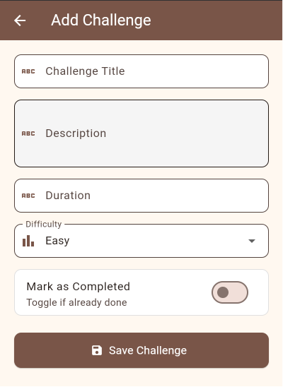
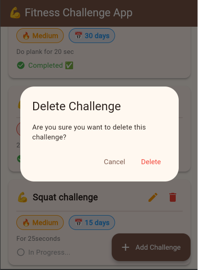
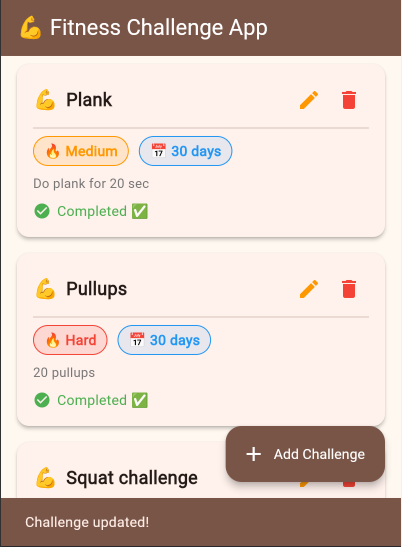

 Fitness Challenge App

A Flutter application that performs CRUD operations using
**Dio** package and **Bloc** state management.

## Description
This app allows users to create and track fitness challenges.
Users can add workout challenges, monitor progress,
update challenge status, and delete completed or unwanted challenges.

## Features
-  Create new fitness challenges
-  Read and display all challenges
-  Update challenge details and completion status
-  Delete challenges
-  Loading states with spinner
-  Error handling with SnackBar
-  Difficulty color indicators
-  Clean architecture with Repository pattern

## API
Built with [MockAPI](https://mockapi.io)
**Base URL:** `https://6a09e92be7e3f433d48392be.mockapi.io/api/challenges`

## Screenshots

### Home Screen
.png)

### Add Challenge

### Edit Challenge

### Delete Challenge

### Updated Challenge

